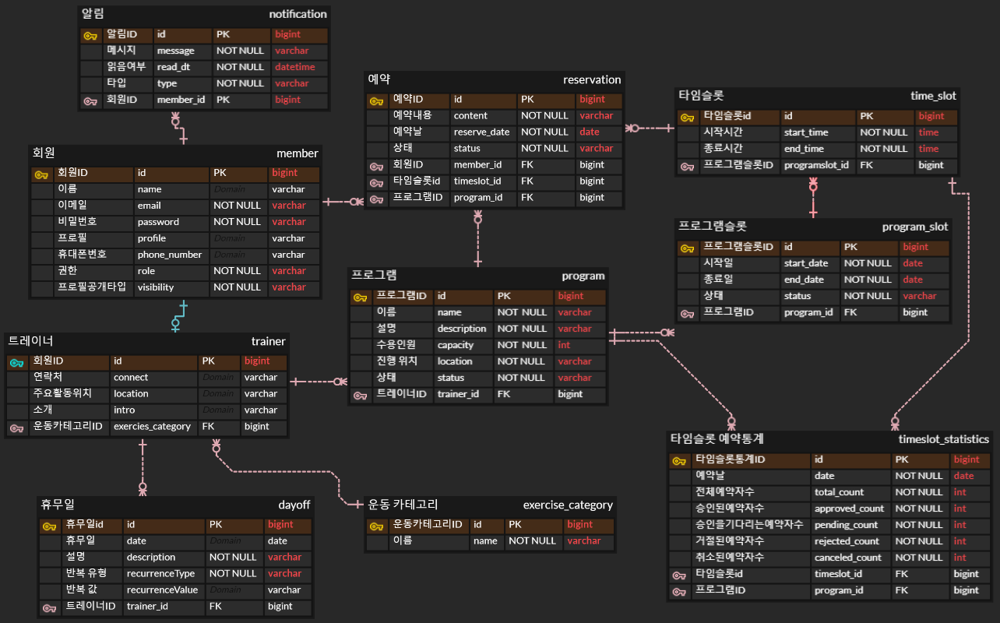

# FitMate: 강습 예약 시스템

## 프로젝트 설명

FitMate는 사용자들이 운동 강습을 예약하고 관리할 수 있는 플랫폼입니다.
이 시스템은 운동 강사와 사용자 간의 예약 프로세스를 지원하여
사용자들이 적합한 강습을 선택하고 효과적으로 운동을 할 수 있도록 돕습니다.

## 프로젝트 기능

[회원]

- 회원가입
    - 사용자는 일반유저 또는 트레이너로 회원가입을 할 수 있다.
- 로그인
    - 사용자는 회원가입 후 로그인을 할 수 있다.

[프로그램]

- 프로그램 등록: 트레이너는 예약을 받을 프로그램을 만들 수 있다.

- 프로그램 설정: 트레이너는 등록한 프로그램을 설정할 수 있다.
    - 기간 및 활동 시간 설정: 시작일, 종료일, 활동 시간을 설정할 수 있다.
    - 상태 설정: 현재 프로그램 예약이 가능하다면 활성화상태 아니면 예약중지 상태 또는 비활성화 상태다.
    - 그외 설정 값: 프로그램명, 운동 종목, 인원수, 설명, 위치

- 프로그램 제약사항
    - 활성화 된 프로그램은 최대 3개 만들 수 있다.
    - 해당 프로그램에 예약완료 또는 예약 거절 상태가 되지 않은 유저가 있으면 비활성화로 바꿀 수 없다.
    - 한번 활성화가 된 프로그램은 설명을 제외한 프로그램명, 운동종목, 인원수, 예약시작일, 예약종료일을 변경할 수 없다.

[프로그램 예약]

- 트레이너가 만든 프로그램은 로그인한 일반 유저로 부터 프로그램 예약이 가능하다.
    - 활성화 여부: 프로그램이 예약 중지 또는 비활성화인 경우 못받는다.
    - 중복 예약 방지: 유저가 예약하려는 시간대와 동일한 시간대의 예약내역이 이미 있다면 예약이 불가능하다.
    - 인원수: 예약 요청하려는 예약 인원수와 현재 예약된 인원수의 합이 최대 인원수를 넘는다면 예약이 불가능하다.
    - 최소예약 시간: 30분 전이다.
- 트레이너는 유저가 예약한 내용을 승인 거절할 수 있다.
- 유저는 예약 취소를 할 수 있다.
- 유저는 예약했던 프로그램 리스트를 확인할 수 있다.
    - 확인할 때는 최대 30일 범위로 조회할 수 있다.

[검색]

- 검색 공통 필터
    - url로 생각했을 때 받을 queryparam: ?운동종목=…&위치정보(경도위도)=…&검색어=…
- 운동종목:
    - 값이 없다면 모든 종목을 검색
        - 들어올수 있는 값은 운동종목 카테고리 테이블을 만들어 테이블에 있는 값을 사용하거나 enum을 사용할 생각입니다.
- 위치정보(경도위도)
    - 없으면 모든 위치에 대해서 검색
    - 입력된 경도 위도로부터 일정거리 안의 항목들만 검색
- 검색 항목
- 트레이너 검색: 트레이너 name
- 트레이너가 만든 프로그램 검색: 프로그램 name
- 정렬설정 선택가능
- 가까운 순
- 각 검색항목의 이름순
- 각 검색항목의 id순
- ElasticSearch 사용: 공부필요.

[알림]

- 프로그램 알림
- 예약 승인하면 예약자에게 예약 승인 알림을 보낸다.
- 알림 시간
    - 프로그램예약된 전날 오전 9시
    - 프로그램예약 당일 시작 1시간전
- 기술: RabbitMQ 사용

[운동기록]

- 운동시간, 운동종목(종목에 따른 횟수나 시간)

[통계]

- 어제의 (1,2,3등의 운동시간 상위 퍼센트 확인
- 스케줄러로 매일 0시에 어제 하루동안의 운동시간 계산해서 통계테이블에 계산해놓을 것

## ERD

